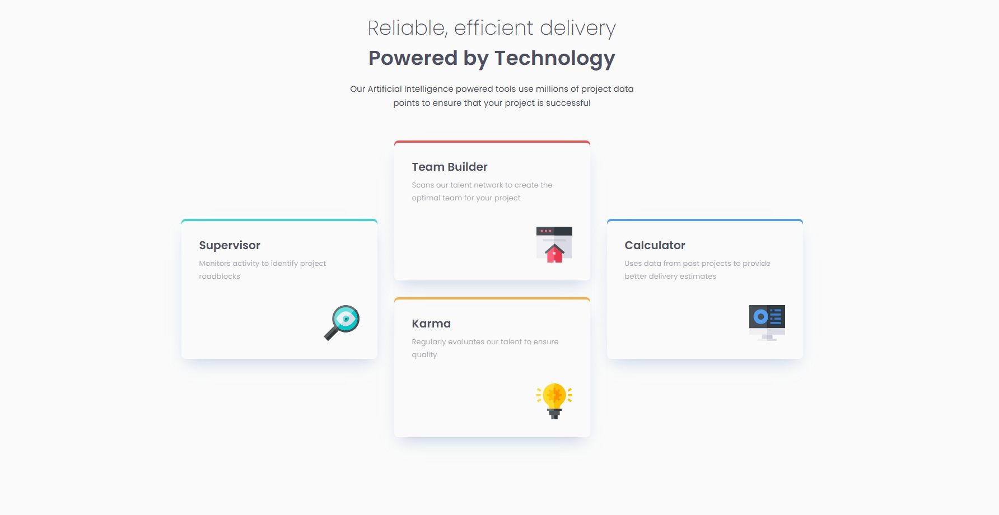
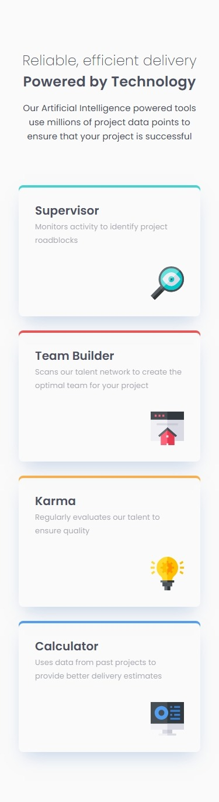

# Frontend Mentor - Four card feature section solution

This is a solution to the [Four card feature section challenge on Frontend Mentor](https://www.frontendmentor.io/challenges/four-card-feature-section-weK1eFYK). Frontend Mentor challenges help you improve your coding skills by building realistic projects.

## Table of contents

- [Overview](#overview)
  - [The challenge](#the-challenge)
  - [Screenshot](#screenshot)
  - [Links](#links)
- [My process](#my-process)
  - [Built with](#built-with)
  - [What I learned](#what-i-learned)
  - [Continued development](#continued-development)
  - [Useful resources](#useful-resources)
- [Author](#author)
- [Acknowledgments](#acknowledgments)

**Note: Delete this note and update the table of contents based on what sections you keep.**

## Overview

### The challenge

Users should be able to:

- See hover and focus states for all interactive elements on the page

### Screenshot

## desktop

### Design

### solution

## Mobile

### Design

### solution

### Links

- Solution URL: [https://github.com/kaafitech/DAY11-FOUR-CARD-FEATURE](https://github.com/kaafitech/DAY11-FOUR-CARD-FEATURE)
- Live Site URL: [https://kaafitech.github.io/DAY11-FOUR-CARD-FEATURE/](https://kaafitech.github.io/DAY11-FOUR-CARD-FEATURE/)

## My process

### Built with

- Semantic HTML5 markup
- CSS custom properties
- Flexbox
- CSS Grid
- Mobile-first workflow
- [Tailwindcss](https://tailwindcss.com/) - CSS Framework

### Continued development

CSS & JS

## Author

- Website - [Kaafi Tech](https://www.kaafitech.com)
- Frontend Mentor - [@kaafitech](https://www.frontendmentor.io/profile/kaafitech)
- Twitter - [@kaafitech](https://x.com/kaafitech)

## Acknowledgments

Thanks Frontend Mentor For The Challenges
